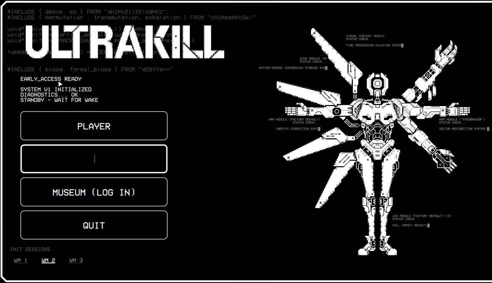

# ULTRAKILL SDDM Theme

ULTRAKILL-themed SDDM login screen with video background, pixel font, and session selection.

## Preview



## Features

- Custom video background (`bg.mp4`)
- Pixel-perfect VCR OSD Mono font
- Session/DE selector (horizontal list at the bottom, switchable via Tab)
- Password login with Enter or "MUSEUM (LOG IN)" button
- Focus/hover states with animated border emphasis
- Autoselects `hyprland-uwsm` session by default

## Dependencies

- `sddm`
- `qt5-base`, `qt5-declarative`, `qt5-quickcontrols2`
- `qt5-multimedia`, `gst-plugins-good`, `gst-libav` (video playback)
- `ttf-vcr-osd-mono` — [AUR](https://aur.archlinux.org/packages/ttf-vcr-osd-mono) (installed automatically)

## Installation

```bash
chmod +x install.sh
sudo ./install.sh
```

The script will:

1. Install all required packages
2. Install the VCR OSD Mono font (via AUR or direct download)
3. Copy theme files to `/usr/share/sddm/themes/ultrakill-sddm/`
4. Set `Current=ultrakill-sddm` in `/etc/sddm.conf`
5. Enable the SDDM service

## Manual install

```bash
sudo mkdir -p /usr/share/sddm/themes/ultrakill-sddm
sudo cp Main.qml theme.conf metadata.desktop logo.png bg.mp4 /usr/share/sddm/themes/ultrakill-sddm/
```

Then set the theme in `/etc/sddm.conf`:

```ini
[Theme]
Current=ultrakill-sddm
```

Restart SDDM:

```bash
sudo systemctl restart sddm
```

## Key bindings

| Key | Action |
|-----|--------|
| `Enter` | Login |
| `Tab` | Cycle through sessions |

## Files

| File | Description |
|------|-------------|
| `Main.qml` | Theme QML file |
| `theme.conf` | SDDM theme config |
| `metadata.desktop` | Theme metadata |
| `logo.png` | ULTRAKILL logo |
| `bg.mp4` | Background video |
| `install.sh` | Installation script |

## Credits

- Font: [VCR OSD Mono](https://www.dafont.com/vcr-osd-mono.font) by Riciery Leal
- GRUB theme reference: [ultrakill-grub-theme](https://github.com/AdrienZianne/ultrakill-grub-theme)
